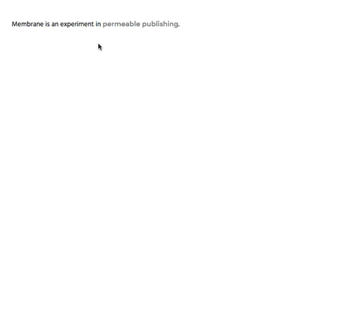

# An experiment in permeable publishing.



You need Go, Mongo, and Mercurial to run Membrane.

How to start it up:

* Start up Mongo: ```mongod --dbpath /your/path/to/membrane/data``` 
* Put membrane in your gopath
* ```go get .```
* ```go build && ./membrane```
* Create a user account for yourself: POST to the `/register` endpoint, e.g. 
```
   {
    "username" : "jane",
    "password" : "sosecure"
   }
```
* Create a promptset for yourself: POST to the `/promptsets` endpoint, e.g. 
```
	{
	    "parent":"jane",
	    "prompts": [
	        "why",
	        "help"
	    ]
	}
```
* Log in: go to `/login` and type in your username and password
* Write your initial text: you should be redirected to `/initial`, which is where you'll post your first text
* Go to `/{yourslug}` to see your initial text--try highlighting a piece and selecting a question from the dropdown
* Go to `/admin/{yourslug}` to see and answer questions asked about your text
* Go back to `/{yourslug}` to see your answer highlighted on the frontend


# Current API endpoints

`POST /register` - register a new author

`GET /authors` - get all the authors

`GET /promptsets` - see all promptsets

`GET /promptsets/{author}` - get an author's promptset

`POST /promptsets` - add a promptset


```GET /users``` - get all the users

```POST /users``` - add a user

```GET /users/check``` - lookup user (for frontend cookie checking)

```GET /users/{userId}``` - get one particular user

```GET /users/{userId}/prompts``` - get all prompts submitted by a particular user


```GET /responses``` - get all the responses

```POST /responses``` - add a response

```DELETE /responses/{responseId}``` - delete a response

```GET /responses/{responseId}``` - get one particular response

```GET /responses/{responseId}/prompts``` - get all the children of a given response.

`PUT /slug/{slug}` - update a response

```GET /responses/{responseId}/prompts/answered``` - get all the children of a given response *that also have responses as children.* E.g., if you want to get all prompts branching off a response, but limit those prompts only to ones that have child responses in response. Useful for frontend development, so users don't see the whole mass of prompts posted on a response.

`GET /responses/{responseId}/prompts/anchors` - get all the prompts that are answered+anchors

`GET /responses/{responseId}/ancestor` - get an anchor ancestor for a given response

```GET /prompts``` - get all the prompts

```POST /prompts``` - add a prompt

```POST /prompts/{promptId}``` - update prompt anchor state

```DELETE /prompts/{promptId}``` - delete a prompt

```GET /prompts/{promptId}``` - get one particular prompt

```GET /prompts/{promptId}/responses``` - get all the children of a given prompt.

```GET /notifications``` - get all notifications

```POST /notifications/user/``` - get all notifications for a given user (intended for frontend use--posts cookie)

```POST /notifications/user/read``` - mark all notifications for a given user as read

```POST /notifications``` - add a notification


# Current framework thoughts:

The goal of this project is to explore what it looks like when a webpage or digital publishing platform is given the affordances of the medium: namely, the ability to edit things live/on the fly, receive prompts from people as they read it, and in general create a more fluid/weird power relationship between creator and consumer.

The system is broken down into two pieces: responses and prompts.

A ***response*** is any asset generated by the owner of the platform/site. That could be the core asset, or it could be any asset generated subsequently (e.g. something they write based on a prompt they get).

A ***prompt*** is any piece of feedback coming from the user. At the moment, users create prompts by highlighting text, choosing the way they want the author to respond, and submitting that.

By treating all assets generated by the creator as a response, it means we can allow consumers to do things like mark up a response replying to a prompt with more prompts, allowing consumers to wander down through the branches of an asset.